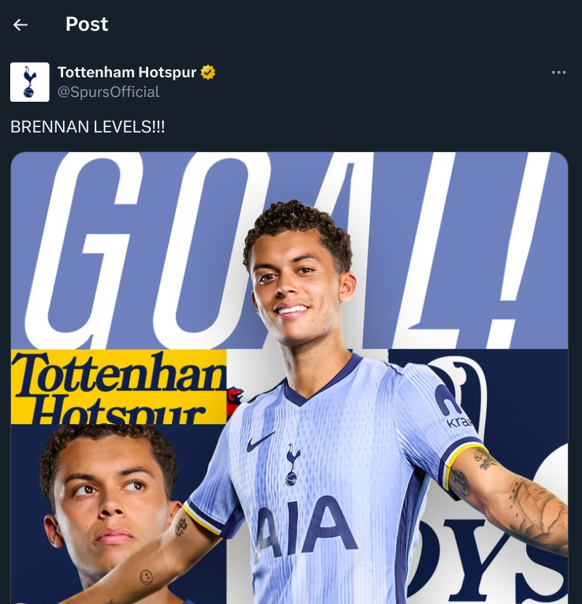
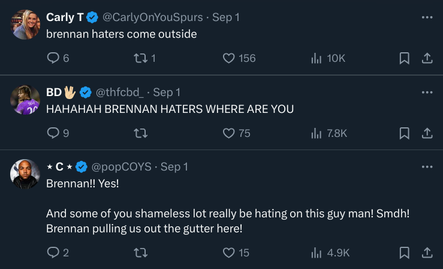

# NLP Research

*Extension of [Govindarajan et al., 2024](https://arxiv.org/abs/2406.17947)*

> How do **cultural differences** shape the expression of **intergroup bias**, and how do members of **individualist** and **collectivist** cultures vary in their manifestations of this bias?

### Definitions
* Cultural differences: the variations in beliefs, values, and behaviours that exist in members of different cultural backgrounds
* Intergroup bias: the tendency to favor and to attribute positive characteristics to members of one's own social category (their in-group) over members of their out-group
* Individualism vs Collectivism: In Hofstede's Cultural Dimensions Theory, Individualism vs Collectivism was defined as a category that shapes culture, and in particular, shapes the way that people within the culture relate to each other.
    * In individualistic cultures, more emphasis is placed on one's personal needs and achievements.
    * In collectivist cultures, more emphasis is placed on the obligations of one's in-group, and members are more willing to sacrifice their own needs to benefit the broader group.

### Approach
*As of Sept. 6, 2024*

My current approach to the research question is to examine manifestations of intergroup bias in fan comments to in-game tweets by official English Premier League (EPL) club accounts. 

An example of an in-game tweet in reaction to a goal:

     

The replies to the above tweet: 

     

One can assume that the replies to a club's in-game tweets (which I will be referring to as *parent tweets*) are generally posted by fans of that club, i.e., the in-group. However, it is worth noting that Twitter has seen an influx in bot comments recently. Potential approaches to removing those from dataset contention are to only take comments from accounts who follow the club official account, to identify common trends in bot comments such that they can be filtered out, or to simply obtain comments from several seasons prior (during which there was less of a bot problem).

I can obtain a parallel dataset by obtaining data from both teams participating in a game based on timestamps, and I can match each tweet to a certain in-game event by corresponding with football game statistics apps / APIs, such as Opta, Sofascore, etc.

While recent restrictions and changes to the Twitter API have posed difficulties, the [twscrape](https://github.com/vladkens/twscrape) library facilitates tweet-scraping, and also allows for the collection of metadata such as user geolocation, user followings, and so on. 

While the current plan is to primarily scrape replies to in-game official account tweets, another avenue of exploration is to scrape tweets from specific users that are not necessarily in response to official club account tweets, as many fans tend to just post to their timeline for their followers. However, challenges to this include 1) identification of specific accounts to scrape from and avoiding bots, and 2) determining which tweets are in reaction to the in-group game (as fans may also tweet about other concurrent games).

I have chosen to use EPL fan comments from Twitter as my space of examination for the following reasons: 

1. In-group and out-group assignments are created when two teams face each other (of course, this applies to any sport from any social media platform)
2. EPL official club accounts live-tweet to update followers on significant in-game events, such as goals (scored or conceded), injuries, halftime/fulltime, etc. 
3. The EPL has a hugely international fanbase - this will allow me to examine members of varying cultures
    * Geolocation data can be obtained for each tweet
4. The prior work in this area (Govindarajan et al., 2024) uses an NFL dataset scraped from Reddit. While comprehensive, the main limitation of that dataset is that Reddit and the NFL have a primarily American fanbase. Furthermore, it would be beneficial to expand that dataset to incorporate a different sport (soccer / European football) and different demographics to assess the generalizability of the findings.

### Subquestions
> How do **cultural differences** shape the expression of **intergroup bias**, and how do members of **individualist** and **collectivist** cultures vary in their manifestations of this bias?

1. Extension of Govindarajan et al. - how does intergroup bias change as in-game events occur? E.g., are there variations in expressions of bias when the in-group team is winning vs losing?
    * Are these findings comparable to that of Govindarajan et al.? As in, are their findings generalizable to more sports and a wider or different demographic?
2. With consideration of subquestion 1, are there also variations in how members of varying cultures express intergroup bias?