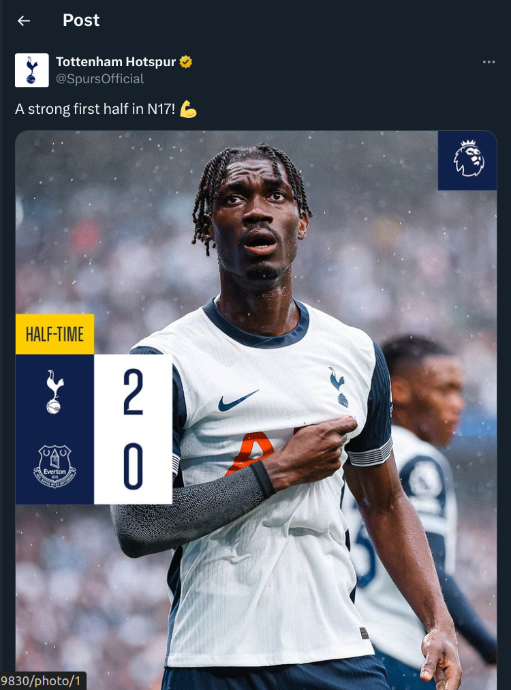
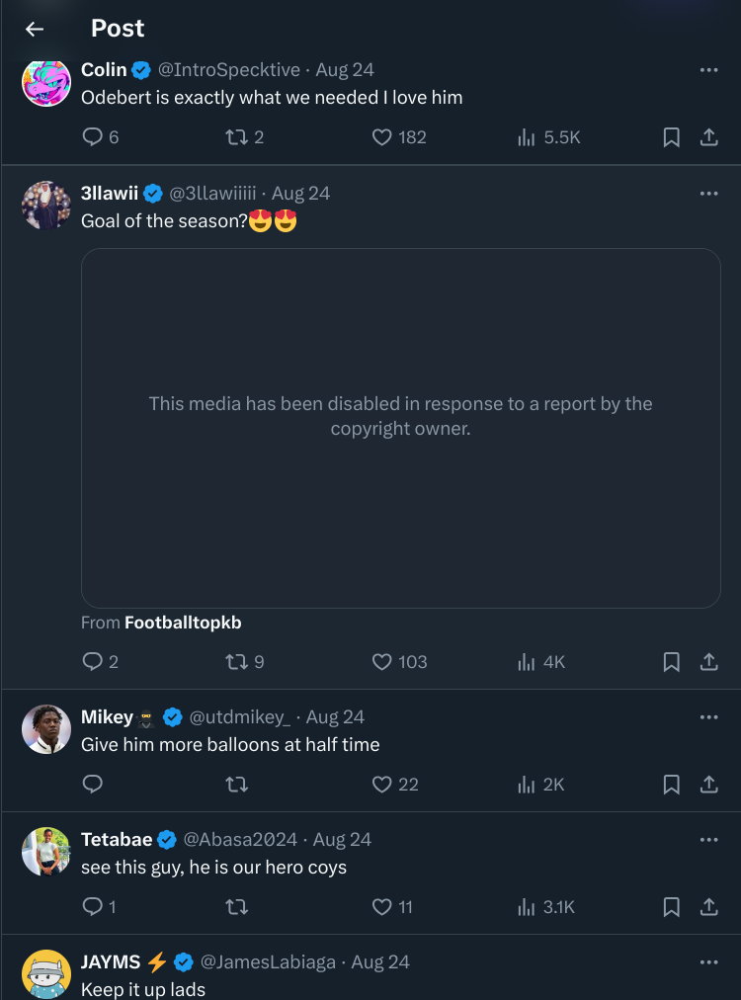
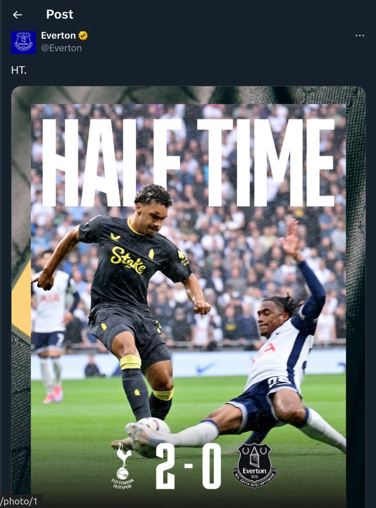
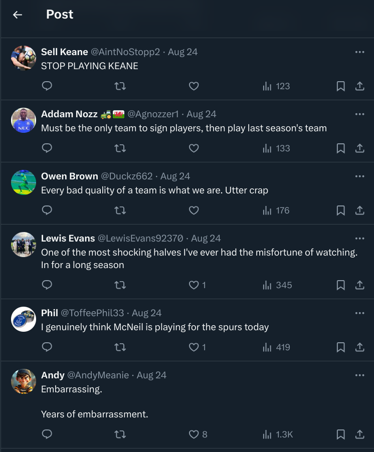

# Aug. 29 Notes

### Summary of Govindarajan et al.

Primarily addresses two questions: 
1. How does language change systematically when referring to members of an in-group vs members of an out-group?
2. How do circumstances influence the aforementioned systematic variation?

### Agenda
1. Introduction: Hi everyone, my name is Jasmine and I am a junior Statistics and Data Science major, and I am also pursuing a CS certificate. I took Jessy's Machine Learning for Text Analysis class last semester and it has been my favorite class at UT so far, so I'm super excited about this opportunity to continue exploring my interests in computational linguistics / NLP. 
2. Motivations: So my final project last semester was somewhat similar to this project in that I scraped comments from sports fans and did some analyses with them. What I really like about this intergroup bias project is that it integrates my interest in sports with psychology. I've always been interested in how our thoughts and emotions manifest in our words and actions.
3. Preface: So I met with Jessy yesterday to discuss some of my research ideas. I haven't had a lot of time to refine all my thoughts, but I do have two ideas that I wanted to tentatively propose so I can get some constructive feedback from you all. 

### Proposal

* **Do cultural differences manifest in expressions of intergroup bias? Specifically, how do members of an individualist vs collectivist culture express intergroup bias differently?**
    * I would imagine that members of individualist cultures would express their intergroup bias more explicitly.
    * Challenge: very difficult to obtain comparable regional datasets; the other approach would be to make cross-sport comparisons (NFL results vs EPL results) which is not ideal but perhaps interesting nonetheless
* **How do emotional triggers arising from specific in-game events (e.g. in the context of a soccer game, scoring a goal would trigger excitement for the in-group) influence linguistic variations of intergroup bias [in sports fans]?**
    * My idea is to take advantage of the in-game tweets posted by official club accounts. I want to label each "parent" tweet as an emotional trigger, and then take the replies (and maybe quote retweets) to those tweets and look into trends associated with particular emotional triggers. 
        * Kind of like using trigger events as the "state-of-the-world" mentioned in the paper instead of win probability. Think this is beneficial bc bias and human behaviour in general are often triggered by emotional stimuli.
        * I do think it would still be necessary to integrate live scores with the trigger though
    * Combine the parent tweets with the live game score (at the tweet's timestamp)
    * Challenge: would have to grab Twitter data, which I do *not* enjoy, but I do think that live in-game tweets by official club accounts are valuable, and Twitter tends to be more emotionally expressive than Reddit, at least to me
        * Additionally, the demographics of Twitter fans are more diverse than that of Reddit. Reddit has a primarily American userbase. 
        * Note that the r/PremierLeague subreddit does have live match threads, but I would not be able to get directed reactions to specific in-game events.
    * Logistics: 
        * Twitter API restrictions make it tedious to scrape large amounts of tweets. The `twscrape` library facilitates this.

 

vs

---

### Meeting notes

* Group likes the idea of expanding the dataset to include 1) a different sport and 2) a different demographic of people (fans).
* The NFL dataset has the events (emotional stimuli) already, and so it would be nice to try the idea on that first. Just need to emotion code them.
* Scrape the data for all relevant teams
